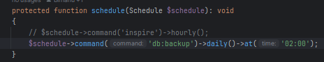
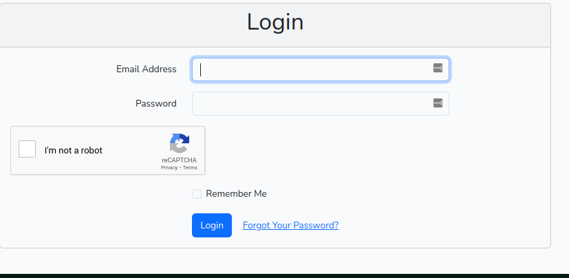
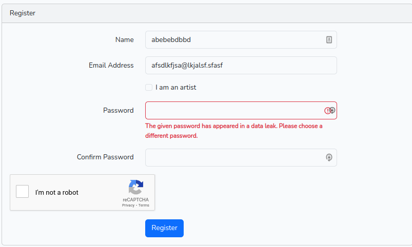
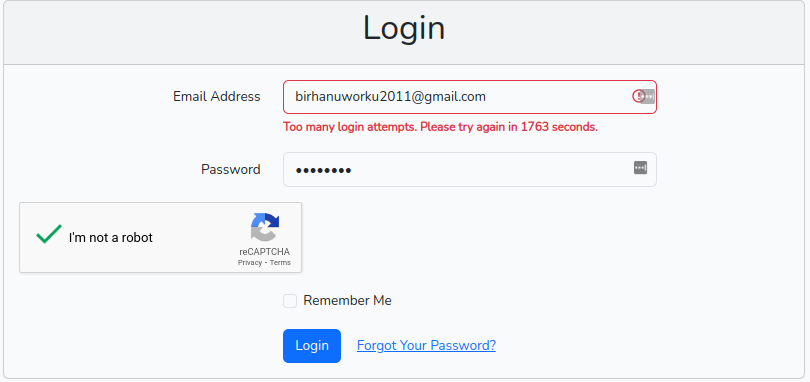
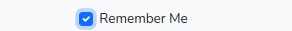

# Computer System Security - Project 1

# SafeTunes --- A secure online music player

# Security Features

# 1. Role Based Access Control (RBAC)
## 1.1. User
### 1.1.1. User Registration
### 1.1.2. User Login
### 1.1.3. User Logout
### 1.1.4. User Profile
### 1.1.5. User Password Change
### 1.1.6. User Password Reset
### 1.1.7. User Song Search
### 1.1.8. User Song Play
### 1.1.9. User View News
### 1.1.10. User View Artist
### 1.1.11. User View Album
### 1.1.12. User View Playlist

## 1.2. Artist
### 1.2.1. Artist Registration
### 1.2.2. Artist Login
### 1.2.3. Artist Logout
### 1.2.4. Artist Profile
### 1.2.5. Artist Password Change
### 1.2.6. Artist Password Reset
### 1.2.7. Artist Song Upload
### 1.2.8. Artist Song Delete
### 1.2.9. Artist Song Update
### 1.2.10. Artist album upload
### 1.2.11. Artist album delete
### 1.2.12. Artist album update

## 1.3. Admin
### 1.3.1. Admin Registration
### 1.3.2. Admin Login
### 1.3.3. Admin Logout
### 1.3.4. Admin Profile
### 1.3.5. Admin Password Change
### 1.3.6. Admin Password Reset
### 1.3.7. Admin User Management
### 1.3.8. Admin Artist Management
### 1.3.9. Admin News Management
### 1.3.10. All admins receive email when new admin is added
### 1.3.11. A users is notified when his account role is changed to admin
### 1.3.12. Admin can view all users
### 1.3.13. Admin can view all artists
### 1.3.14. Admin can view all news
### 1.3.15. Admin can view all songs
### 1.3.16. Admin can view all albums

# 2. Audit Trails and Logging
## 2.1. User
### 2.1.1. User registration is logged
### 2.1.2. User login is logged
### 2.1.3. User logout is logged

## 2.2. Artist
### 2.2.1. Artist registration is logged
### 2.2.2. Artist login is logged
### 2.2.3. Artist logout is logged
### 2.2.4. Artist song upload is logged
### 2.2.5. Artist song delete is logged
### 2.2.6. Artist song update is logged
### 2.2.7. Artist album upload is logged
### 2.2.8. Artist album delete is logged
### 2.2.9. Artist album update is logged

## 2.3. Admin
### Admins can view all logs

# 3. Data Backups
## 3.1. All the data in the database are backed up every 24 hours at 2:00 AM

# 4. Identification and Authentication
## 4.1. User Registration
## 4.2. Preventing Fake Accounts: bot prevention: 
### Google captcha implemented in all the forms the project

# 5. Password Authentication
## 5.1. Password Policies:
* Passwords must be at least 12 characters long
* password must contain mixed case letters, numbers and special characters
* Uncompromised---passwords are checked against the haveibeenpwned database

# 6. Account Lockout Policy
## Account lockout after 5 failed login attempts

# 7. Token-Based Authentication

